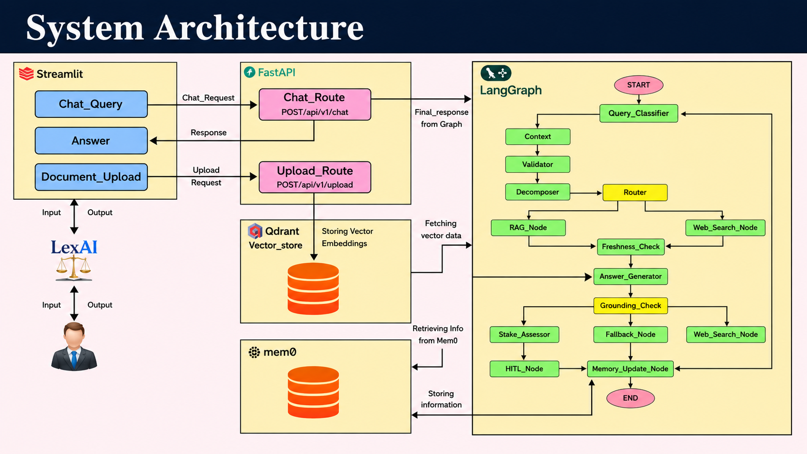

# LexAI — Agentic Constitutional Law Assistant

**An intelligent, responsible AI agent that helps ordinary citizens understand their legal rights using uploaded documents or web search.**




## 🎯 Overview

LexAI is a **production-grade agentic AI system** designed to bridge the gap of **legal illiteracy**. It allows users with zero legal background to:

- Upload a PDF of their country's constitution, civil code, or specific law
- Ask questions in plain language
- Receive **grounded, cited, and honest** answers with safety guardrails

The agent follows a sophisticated multi-node reasoning workflow built with **LangGraph**, ensuring transparency, traceability, and responsible behavior — especially in high-stakes situations.

## ✨ Key Features

- **Dual Knowledge Sources**: RAG over uploaded legal documents + Tavily web search fallback
- **Agentic Reasoning**: Query decomposition, jurisdiction clarification, freshness checking
- **Strong Safety Guardrails**:
  - Document validation
  - Retrieval confidence scoring
  - Grounding/faithfulness checks
  - Honest fallback when confidence is low
  - Automatic escalation to "consult a lawyer" for high-stakes matters
- **Memory**: Short-term (session) + Long-term (persistent user profile)
- **Observability**: Full tracing with **LangSmith**
- **Professional Backend**: FastAPI with clean REST endpoints
- **Modern Architecture**: Fully modular, type-safe, and production-ready

## 🛠 Tech Stack

- **Orchestration**: LangGraph + LangChain
- **LLM**: Groq (Llama 3.3 70B Versatile)
- **RAG**: FAISS + HuggingFace `all-MiniLM-L6-v2` embeddings + PyPDF
- **Web Search**: Tavily
- **Backend**: FastAPI + Uvicorn
- **Frontend**: Streamlit (planned)
- **Observability**: LangSmith
- **Others**: Pydantic, python-dotenv, sentence-transformers

## 📁 Project Structure

```bash
lexai-law-agent/
├── app/
│   ├── main.py                 # FastAPI entry point
│   ├── core/config.py
│   ├── schemas/
│   ├── api/routes/             # Chat & Document endpoints
│   ├── graph/
│   │   ├── graph_builder.py    # Full LangGraph assembly
│   │   ├── state.py
│   │   └── nodes/              # 11 specialized nodes
│   ├── rag/                    # Document loading, chunking, embedding
│   ├── tools/
│   ├── memory/
│   └── utils/
├── ui/                         # Streamlit frontend (in progress)
├── tests/
├── uploads/                    # User-uploaded PDFs
├── faiss_index/                # Vector stores
├── .env
├── requirements.txt
└── README.md
```

## 🚀 Installation & Setup

## 1. Clone the repository
```bash
Bashgit clone https://github.com/yourusername/lexai-law-agent.git
cd lexai-law-agent
```
## 2. Create virtual environment
```bash
Bashpython -m venv myenv
# Windows
myenv\Scripts\activate
# Linux/macOS
source myenv/bin/activate
```
## 3. Install dependencies
```bash
Bashpip install -r requirements.txt
```
## 4. Set up environment variables
```bash
Create .env file in root:
envGROQ_API_KEY=your_key
TAVILY_API_KEY=your_key
LANGCHAIN_API_KEY=your_key
HUGGINGFACEHUB_ACCESS_TOKEN=your_key

LANGCHAIN_TRACING_V2=true
LANGCHAIN_PROJECT=lexai-law-agent
```

## 5. Run the backend
```bash
Bashuvicorn app.main:app --reload
Visit: http://127.0.0.1:8000/docs (Swagger UI)
🧪 Testing
Run the end-to-end graph test:
Bashpython -m tests.test_graph
```